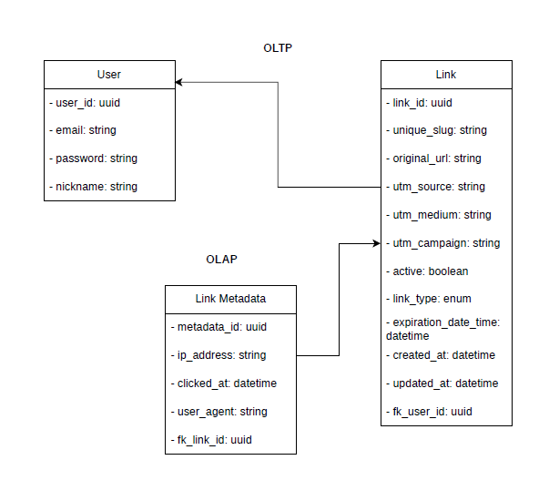
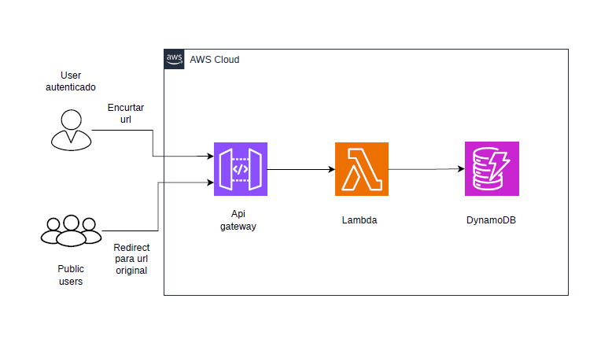
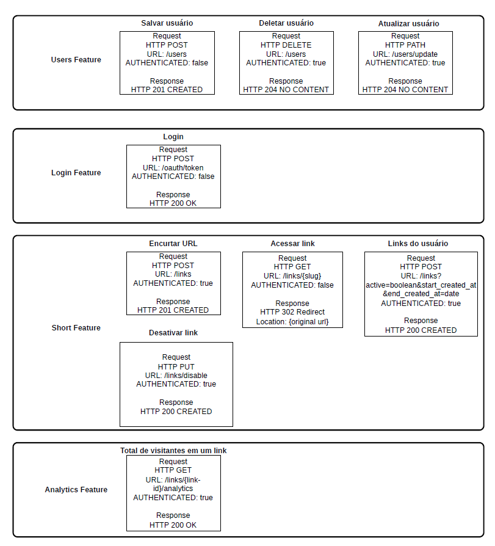

# Encurtador de link FBR

Esse projeto conta com algumas decisões técnicas importantes. É uma aplicação
Heavy Read (Leitura pesada), o padrão de acesso é esporádico, vamos utilizar
Serveless com Java, compilação nativa (GraalVM) e Spring Boot.

Modelagem de domínio 

Arquitetura AWS

Contrato de API

